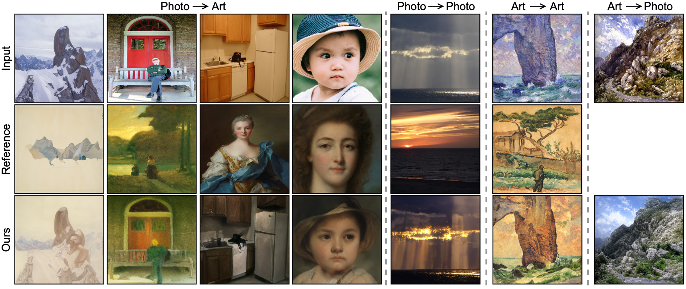

# QuantArt
Official PyTorch implementation of the paper:

[**QuantArt: Quantizing Image Style Transfer Towards High Visual Fidelity**](https://arxiv.org/abs/2212.10431)  
[Siyu Huang<sup>*</sup>](https://siyuhuang.github.io) (Harvard), [Jie An<sup>*</sup>](https://www.cs.rochester.edu/u/jan6/) (Rochester), [Donglai Wei](https://donglaiw.github.io/) (BC), [Jiebo Luo](https://www.cs.rochester.edu/u/jluo/) (Rochester), [Hanspeter Pfister](https://vcg.seas.harvard.edu/people/hanspeter-pfister) (Harvard)  
CVPR 2023

We devise a new style transfer framework called QuantArt for high visual-fidelity stylization. The core idea is to push latent representation of  generated artwork toward centroids of real artwork distribution with vector quantization. QuantArt achieves decent performance for various image style transfer tasks.

<p align='center'>
 
</p>

## Dependencies
* python=3.8.5
* pytorch=1.7.0
* pytorch-lightning=1.0.8
* cuda=10.2
 
We recommend to use `conda` to create a new environment with all dependencies installed.
```
conda env create -f environment.yaml
conda activate quantart
```

## Quick Start
Download the [pre-trained landscape2art model](https://drive.google.com/drive/folders/1zuz9CmgpB7JsEx-Y5H0K0u3D95C6g4MU?usp=share_link) and put it under `logs/`. Run
```
bash test.sh
```
Results will be saved in `logs/`.

## Datasets and Pre-trained Models
**Stage-1:** The datasets and pre-trained models for codebook pretraining are as follows:

| Dataset | Pre-trained Model |
| ---- | ---- |
| [MS_COCO](https://cocodataset.org/#download) | [vqgan_imagenet_f16_1024.ckpt](https://drive.google.com/file/d/1lcrBplMVQTO6-ppxSWUyD_2coUiUpwoS/view?usp=share_link) |
| [WikiArt](https://www.kaggle.com/competitions/painter-by-numbers/data) | [vqgan_wikiart_f16_1024.ckpt](https://drive.google.com/file/d/1xIYbaXLEdroYeftzM_1r5q2P9ANhQQpv/view?usp=share_link) |
| [LandscapesHQ](https://github.com/universome/alis) | [vqgan_landscape_f16_1024.ckpt](https://drive.google.com/file/d/13VjJonTCJWz2QEIGX_KeO1RB3t15qTBE/view?usp=share_link) |
| [FFHQ](https://github.com/NVlabs/ffhq-dataset) | [vqgan_faceshq_f16_1024.ckpt](https://drive.google.com/file/d/1_6ZW8iVhFentkG_HTn5pMj4JRAiPUHwY/view?usp=share_link) |
| [Metfaces](https://github.com/NVlabs/metfaces-dataset) | [vqgan_metfaces_f16_1024.ckpt](https://drive.google.com/file/d/1omGG6TmSVsksk39pGPkyLVTa-K4FcxQd/view?usp=share_link) |

**Stage-2:** The datasets and pre-trained models for style transfer experiments are as follows:

| Task | Pre-trained Model | Content | Style |
| ---- | ---- | ---- | ---- |
| photo->artwork| [coco2art](https://drive.google.com/drive/folders/13-z3eowPsPjKTIULP5sBrr_jgJn3w7ZH?usp=share_link) | [MS_COCO](https://cocodataset.org/#download) | [WikiArt](https://www.kaggle.com/competitions/painter-by-numbers/data) |
| landscape->artwork | [landscape2art](https://drive.google.com/drive/folders/1zuz9CmgpB7JsEx-Y5H0K0u3D95C6g4MU?usp=share_link)| [LandscapesHQ](https://github.com/universome/alis) |[WikiArt](https://www.kaggle.com/competitions/painter-by-numbers/data) |
| landscape->artwork (non-VQ) | [landscape2art_continuous](https://drive.google.com/drive/folders/1s-N62W8l_1iOvydsWvmJTWxNwWWJKTum?usp=share_link)| [LandscapesHQ](https://github.com/universome/alis) | [WikiArt](https://www.kaggle.com/competitions/painter-by-numbers/data) |  
| face->artwork | [face2art](https://drive.google.com/drive/folders/1wKWmmtLChtXTWFaaun097H7lYJ6-IWTe?usp=share_link) | [FFHQ](https://github.com/NVlabs/ffhq-dataset) | [Metfaces](https://github.com/NVlabs/metfaces-dataset) |
| artwork->artwork | [art2art](https://drive.google.com/drive/folders/1J48c21bN5f9anGBUSALcEMO0Bj8Emd0s?usp=share_link) | [WikiArt](https://www.kaggle.com/competitions/painter-by-numbers/data) | [WikiArt](https://www.kaggle.com/competitions/painter-by-numbers/data) |
| photo->photo | [coco2coco](https://drive.google.com/drive/folders/1xc5P1woZJSoemcVvjnZ4Gj5Jyam7RsQZ?usp=share_link) | [MS_COCO](https://cocodataset.org/#download) | [MS_COCO](https://cocodataset.org/#download) |
| landscape->landscape | [landscape2landscape](https://drive.google.com/drive/folders/1bmL25tOwuXt63wXwpNwlSW775sjrPhxL?usp=share_link) | [LandscapesHQ](https://github.com/universome/alis) | [LandscapesHQ](https://github.com/universome/alis) |

## Testing
Follow **Datasets and Pre-trained Models** to download more datasets and pretrained models. For instance for photo-to-artwork style transfer model, the folder structure should be
```
QuantArt
├── configs
├── datasets
│   ├── lhq_1024_jpg
│   │   ├── lhq_1024_jpg
│   │   │   ├── 0000000.jpg
│   │   │   ├── 0000001.jpg
│   │   │   ├── 0000002.jpg
│   │   │   ├── ...
│   ├── painter-by-numbers
│   │   ├── train
│   │   │   ├── 100001.jpg
│   │   │   ├── 100002.jpg
│   │   │   ├── 100003.jpg
│   │   │   ├── ...
│   │   ├── test
│   │   │   ├── 0.jpg
│   │   │   ├── 100000.jpg
│   │   │   ├── 100004.jpg
│   │   │   ├── ...
├── logs
│   ├── landscape2art
│   │   ├── checkpoints
│   │   ├── configs
├── taming
├── environment.yaml
├── main.py
├── train.sh
└── test.sh
```

Run the following command to test the pre-trained model on the testing dataset:
```
python -u main.py --base logs/landscape2art/configs/test.yaml -n landscape2art -t False --gpus 0,
```

* `--base`: path for the config file.
* `-n`: result folder under `logs/`.
* `-t`: is training.
* `--gpus`: GPUs used.


## Training
**Stage-1:** Run the following command to train a Stage-1 model (i.e., an autoencoder and a codebook). Four GPUs are recommended but not necessary.
```
python -u main.py --base configs/vqgan_wikiart.yaml -t True --gpus 0,1,2,3
```

Two separate Stage-1 models are required for content and style datasets, respectively.

**Stage-2:** Run `bash train.sh` or the following command to train a photo-to-artwork model
```
python -u main.py --base configs/coco2art.yaml -t True --gpus 0,
```

* `--base`: path for the config file.
* `-n`: result folder under `logs/`.
* `-t`: is training.
* `--gpus`: GPUs used.
* `--resume_from_checkpoint`: resume training from a checkpoint.

More training configs of Stage-2 models can be found in `configs/`.

## Custom Dataset
**Unpaired data:**
To test unpaired data, follow comments in `configs/custom_unpaired.yaml` to specify model checkpoints and data paths. Then run
```
python -u main.py --base configs/custom_unpaired.yaml -n custom_unpaired -t False --gpus 0,
```
**Paired data:**
To test paired data, the corresponding content and style images (in two folders) should have the same file names. Follow comments in `configs/custom_paired.yaml` to specify model checkpoints and data paths, then run
```
python -u main.py --base configs/custom_paired.yaml -n custom_paired -t False --gpus 0,
```

## Citation
```
@inproceedings{huang2023quantart,
    title={QuantArt: Quantizing Image Style Transfer Towards High Visual Fidelity},
    author={Siyu Huang and Jie An and Donglai Wei and Jiebo Luo and Hanspeter Pfister},
    booktitle={Proceedings of the IEEE Conference on Computer Vision and Pattern Recognition},
    month={June},
    year={2023}
}
```

## Acknowledgement
This repository is heavily built upon the amazing [VQGAN](https://github.com/CompVis/taming-transformers).

## Contact
If you have any questions, please do not hesitate to contact <huangsiyutc@gmail.com>.
